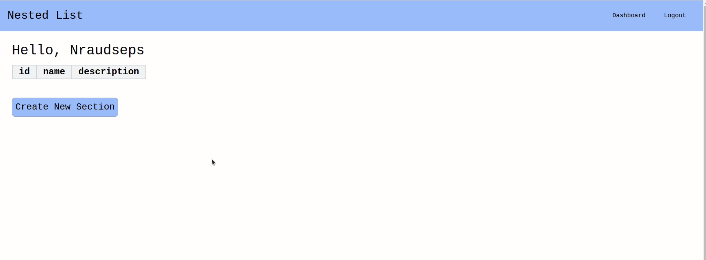

# Nested List

A simple web application where users can make a nested list of sections. A login system is also in place. 
Built almost entirely in PHP.  

## Getting Started

### Prerequisites

1. PHP 7.4 or above
2. Composer 1.10 or above
3. Node v12 or above
4. MySQL (other DMS's are not supported)

### Installation and Setup
1. Clone this repository from Github - `git clone https://github.com/NRaudseps/Nested-list.git`.
2. Create a database in MySQL.
4. Run `npm install`
5. For development run `npm run dev`. This will generate a 4MB tailwindcss file in the public directory. 
For production run `npm run production`.
3. Install Composer on the application `composer install`.
4. Copy the `.env.example` file and rename it `.env`.
5. Set up your .env file. 
6. Run `vendor/bin/phinx migrate -e development` to migrate tables to your database.

